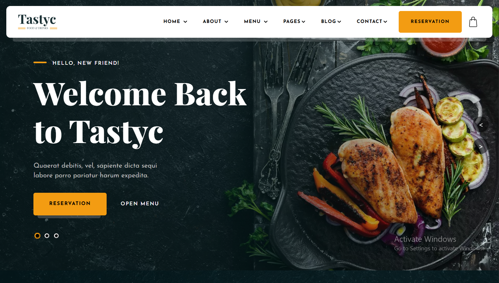

# Tastyc – Restaurant Website


A modern and fully responsive restaurant website built with HTML, CSS, Bootstrap, and JavaScript. The project focuses on delivering an engaging dining experience through clean design, smooth animations, and responsive layouts across all devices.

## 🌐 Live Demo

🔗 **Live Demo:** https://tastycs.netlify.app/

## 📸 Preview



## ✨ Features

- Fully responsive design for desktop, tablet, and mobile devices
- Modern and intuitive user interface
- Home, About, Menu, Gallery, Blog, and Contact pages
- Smooth animations powered by GSAP and AOS
- Interactive sliders and carousels using Swiper.js
- Clean navigation and structured content layout
- Cross-browser compatibility
- Lightweight and optimized front-end architecture

## 🛠️ Technologies Used

- HTML5
- CSS3
- Bootstrap 5
- JavaScript (ES6)
- GSAP
- Swiper.js
- AOS (Animate On Scroll)
- Font Awesome
- Remix Icons

## 📂 Project Structure

```text
Tastyc/
│
├── About-images/
├── Menu-images/
├── css/
├── images/
│
├── index.html
├── About.html
├── Menu.html
├── Gallery.html
├── blog.html
├── contact.html
├── shop.html
│
├── script.js
├── About.js
├── Menu.js
├── Gallery.js
├── Contact.js
├── Shop.js
│
├── Menu.json
└── README.md
```

## 🚀 Getting Started

### Clone the Repository

```bash
git clone https://github.com/AbdulRafay901/Tastyc.git
cd Tastyc
```

### Run Locally

Open `index.html` in your browser or use the VS Code Live Server extension.

> No installation or build tools required. All dependencies are loaded via CDN.

## 📦 Libraries & Dependencies

- Bootstrap 5
- GSAP
- Swiper.js
- AOS
- Font Awesome
- Remix Icons

## 👨‍💻 Author

**Abdul Rafay**

GitHub: @AbdulRafay901

---

⭐ If you found this project useful, consider giving it a star on GitHub.
